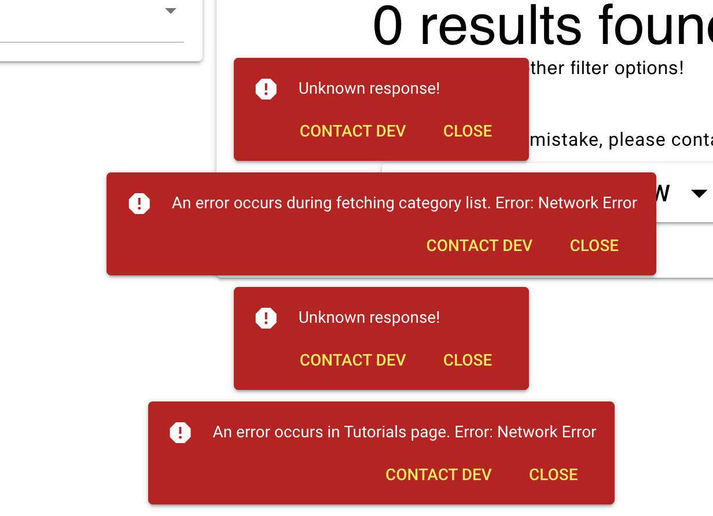

# Frontend Issues

Issues found in graphery frontend.

**Table of Contents**

   * [Layout](#layout)
      * [Header (Menu)](#header-menu)
         * [Ajax bar (Top-loading-bar)](#ajax-bar-top-loading-bar)
      * [Drawer](#drawer)
      * [Footer](#footer)
   * [Home](#home)
   * [Graph](#graph)
      * [Tutorials](#tutorials)
      * [Graphs](#graphs)
      * [Separator of Column](#separator-of-column)
      * [Article](#article)
   * [About](#about)
   * [Account](#account)
      * [Login/Register](#loginregister)
      * [Control Panel](#control-panel)
      * [Settings](#settings)
   * [Miscellaneous](#miscellaneous)
         * [Alert Notification (helper.ts)](#alert-notification-helperts)
   * [Accessibility](#accessibility)
      * [Colorblind Friendly](#colorblind-friendly)
      * [Tab navigation](#tab-navigation)

# Layout

## Header (Menu)

The height of header and the buttons (menu items) can be smaller. Larger one is unfriendly to relatively small screen user and can distract them.

### Ajax bar (Top-loading-bar)

(low priority) Maybe adjust the color of ajax bar to something more compatible with primary color (reed red).

## Drawer

(low priority)

The drawer will only work if the screen width is smaller than the breakpoint `$q.screen.lt.md`

- The title text GRAPHERY is not in the form of logo text.
- The card border should not be rounded
- The menu button
  - Icon size and text size do not match perfectly
  - The color of the icons is too conspicuous, which affects the readability of the text.

## Footer

The footer content only shows in the non-graph page.

# Home

Add welcome message, quick facts (features about graphery)...

# Graph

## Tutorials

The page of archive indexing, redesign:

- the search box

  - currently one is too conspicuous

- paginator

  - add paginator both top and bottom in *Tutorials* List

- Filter categories placeholder blank - label name

  already added *in* `/src/components/ControlPanel/parts/selectors/CategorySelection.vue`
  
  - TODO: move “Fliter” to the title of q-card title, or just leave dropdown box without q-card title “Categories”
  
    (make sure the design language simple and concise)

## Graphs

(low priority) I think *Graphs* can have a different design from *Tutorials*, making multiple cards in grid to guide users to access.

## Separator of Column

(Maybe) An option for remember/ not remember the position of the separators

FIXME: The position of the vertical separators (**Split Pos**) on the following two pages cannot be mixed given their different functions.

- Tutorials (Graph,Code|Article)

- Graphs (Graph|Code)

  ```js
  // Graph.vue & Tutorial.vue
  splitPos: {
          set(d) {
            this.$store.dispatch(
              'settings/changeGraphSplitPos',
              Math.round(d * 10) / 10
            );
          },
  ```

  ```ts
  // /store/modules/settings.ts
  160 dispatch('changeGraphSplitPos', graphSplitPos);
  ```

  

## Article

- FIXME: style of chips
- FIXME: hide back-to-top button when it’s already at the top

- (low priority) FIXME: redesign the CC declaration

# About

Imperfect.

# Account

## Login/Register

## Control Panel

## Settings


# Miscellaneous

### Alert Notification (helper.ts)



(low priority) color is not improper 

- warningDialog
- errorDialog

backend server downtime will trigger more alert pop-ups in the same time, unfriendly.


# Accessibility

## Colorblind Friendly

- [Visual Disabilities Color-blindness - WebAIM](https://webaim.org/articles/visual/colorblind)

TBD

## Tab navigation

- [Keyboard Accessibility - WebAIM](https://webaim.org/techniques/keyboard/)

- [ARIA: tab role in MDN](https://developer.mozilla.org/en-US/docs/Web/Accessibility/ARIA/Roles/Tab_Role)

The quasar framework has perfectly done the adaptation of the tab navigation for us, just click <kbd>Tab</kbd>, the content slection will be highlighted.

